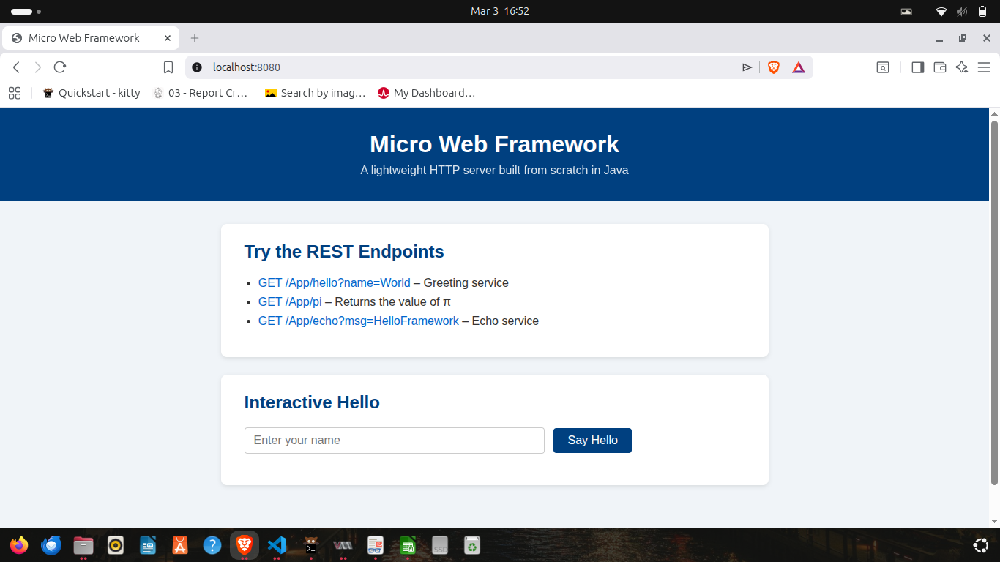
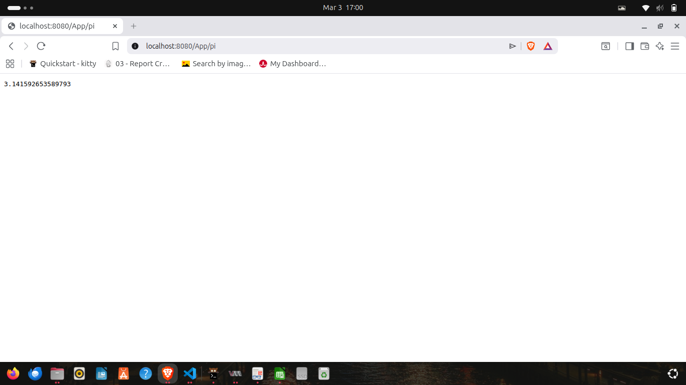

# Micro Web Framework

A lightweight HTTP web framework built from scratch in Java — without any external web server libraries.
The framework lets developers define REST endpoints using **lambda functions** and serve **static files**, all with a clean, declarative API inspired by Spark/Express.

---

## Table of Contents

1. [System Architecture](#system-architecture)
2. [Project Structure](#project-structure)
3. [API Reference](#api-reference)
4. [Installation & Execution](#installation--execution)
5. [Usage Example](#usage-example)
6. [Test Cases & Results](#test-cases--results)

---

## System Architecture

```
Client Browser / HTTP Client
          │
          │  HTTP/1.1 request
          ▼
┌─────────────────────────────────────────┐
│            HttpServer                   │
│                                         │
│  ┌─────────────────────────────────┐    │
│  │        Request Router           │    │
│  │                                 │    │
│  │  /App/* path?                   │    │
│  │  ├── YES → Look up endpoint     │    │
│  │  │         in routes map        │    │
│  │  │         → invoke WebMethod   │    │
│  │  │           lambda             │    │
│  │  └── NO  → Serve static file   │    │
│  │           from classpath        │    │
│  └─────────────────────────────────┘    │
│                                         │
│  Routes: Map<String, WebMethod>         │
│  staticFilesLocation: String            │
└─────────────────────────────────────────┘
          │
          │  HTTP/1.1 response
          ▼
Client Browser / HTTP Client
```

### Key Components

| Class | Role |
|---|---|
| `HttpServer` | Core framework. Owns the server socket, routes table, and request dispatching. |
| `HttpRequest` | Parses and exposes the incoming request path, HTTP method, and URL query parameters. |
| `HttpResponse` | Holds the response status code and content-type that a handler can customise. |
| `WebMethod` | `@FunctionalInterface` — a lambda `(HttpRequest, HttpResponse) → String`. |
| `MainServices` | Demo application that registers routes and starts the server. |
| `LabApplication` | Top-level entry point delegating to `MainServices`. |

### Request Flow

```
GET /App/hello?name=Pedro
      │
      ▼
HttpServer.handleConnection()
  parse request line → path="/App/hello", query="name=Pedro"
  path starts with "/App/" → REST route
  routeKey = "/hello"
  endpoints.get("/hello") → WebMethod lambda
  new HttpRequest("GET", "/hello", "name=Pedro")
  lambda.handle(req, res) → "Hello Pedro"
  sendTextResponse(200, "text/plain", "Hello Pedro")
```

```
GET /index.html
      │
      ▼
HttpServer.handleConnection()
  path does NOT start with "/App"
  staticFilesLocation = "/webroot/public"
  load classpath resource "/webroot/public/index.html"
  detect content-type → "text/html"
  sendFileResponse(200, bytes)
```

---

## Project Structure

```
src/
├── main/
│   ├── java/com/arep/lab/
│   │   ├── HttpServer.java          ← Framework core
│   │   ├── LabApplication.java      ← Entry point
│   │   ├── EchoClient.java          ← (utility, unchanged)
│   │   ├── EchoServer.java          ← (utility, unchanged)
│   │   ├── URLParser.java           ← (utility, unchanged)
│   │   ├── URLReader.java           ← (utility, unchanged)
│   │   └── appexamples/
│   │       ├── HttpRequest.java     ← Request abstraction
│   │       ├── HttpResponse.java    ← Response abstraction
│   │       ├── WebMethod.java       ← Handler functional interface
│   │       └── MainServices.java    ← Demo app
│   └── resources/
│       └── webroot/public/
│           ├── index.html           ← Demo static page
│           ├── styles.css           ← Demo stylesheet
│           └── app.js               ← Demo front-end script
└── test/
    └── java/com/arep/lab/
        └── LabApplicationTests.java ← Unit + integration tests
```

---

## API Reference

### `HttpServer.get(String path, WebMethod handler)`

Registers a GET handler for the given route.

```java
HttpServer.get("/hello", (req, res) -> "Hello " + req.getValues("name"));
```

The route is accessible at `http://localhost:8080/App<path>`.

---

### `HttpServer.staticfiles(String classpathLocation)`

Sets the classpath root directory from which static files are served.

```java
HttpServer.staticfiles("/webroot/public");
// → serves files found in src/main/resources/webroot/public/
```

---

### `HttpServer.start()` / `HttpServer.start(int port)`

Starts the server (blocks the calling thread).

```java
HttpServer.start();           // uses default port 8080
HttpServer.start(9090);       // custom port
```

---

### `HttpRequest`

| Method | Description |
|---|---|
| `getValues(String param)` | Returns the URL query parameter value, or `""` if absent. |
| `getPath()` | Returns the matched route path (e.g. `/hello`). |
| `getMethod()` | Returns the HTTP method (`GET`, `POST`, …). |
| `getQueryParams()` | Returns an unmodifiable map of all query parameters. |

---

### `HttpResponse`

| Method | Description |
|---|---|
| `setStatusCode(int code)` | Override the HTTP status code (default `200`). |
| `setContentType(String type)` | Override the content-type (default `text/plain`). |

---

## Installation & Execution

### Prerequisites

- **Java 17** or later
- **Maven 3.9+** (or use the included `./mvnw` wrapper)
- Git

### Clone & Build

```bash
git clone https://github.com/cris-eci/micro-web-framework
cd lab
./mvnw clean package -DskipTests
```

### Run the Server

```bash
java -jar target/lab-0.0.1-SNAPSHOT.jar
```

Or with Maven:

```bash
./mvnw spring-boot:run
```

The server starts at **http://localhost:8080**.

### Try in the Browser

| URL | Expected Result |
|---|---|
| `http://localhost:8080/index.html` | Static HTML demo page |


| `http://localhost:8080/App/hello?name=Pedro` | `Hello Pedro` |


| `http://localhost:8080/App/pi` | `3.141592653589793` |


| `http://localhost:8080/App/echo?msg=test` | `Echo: test` |


---

## Usage Example

```java
import static com.arep.lab.HttpServer.get;
import static com.arep.lab.HttpServer.staticfiles;
import com.arep.lab.HttpServer;

public class MyApp {
    public static void main(String[] args) throws Exception {

        // Serve static files from src/main/resources/webroot/public/
        staticfiles("/webroot/public");

        // Dynamic REST endpoints
        get("/hello", (req, res) -> "Hello " + req.getValues("name"));

        get("/pi", (req, res) -> String.valueOf(Math.PI));

        get("/greet", (req, res) -> {
            String name = req.getValues("name");
            String lang = req.getValues("lang");
            return switch (lang) {
                case "es" -> "Hola " + name;
                case "fr" -> "Bonjour " + name;
                default   -> "Hello " + name;
            };
        });

        // Start blocking server on port 8080
        HttpServer.start();
    }
}
```

---

## Test Cases & Results

Run the tests with:

```bash
./mvnw clean test
```

### Results (23 tests, 0 failures)

```
Tests run: 23, Failures: 0, Errors: 0, Skipped: 0
BUILD SUCCESS
```

### Unit Tests

| Test | Description |
|---|---|
| `httpRequest_getValues_returnsCorrectValue` | Query param `name=Pedro` → `"Pedro"` |
| `httpRequest_getValues_missingParam_returnsEmpty` | Absent param → `""` |
| `httpRequest_nullQuery_doesNotThrow` | Null query string handled gracefully |
| `httpRequest_multipleQueryParams_parsedCorrectly` | Three params parsed correctly |
| `httpRequest_urlEncodedValue_decodedCorrectly` | `name=John%20Doe` → `"John Doe"` |
| `httpRequest_getPath_returnsPath` | Path stored correctly |
| `httpRequest_getMethod_returnsMethod` | HTTP method stored correctly |
| `httpResponse_defaultStatusCode_is200` | Default status is `200` |
| `httpResponse_defaultContentType_isTextPlain` | Default content-type is `text/plain` |
| `httpResponse_setStatusCode_updatesValue` | Setter works |
| `httpResponse_setContentType_updatesValue` | Setter works |
| `httpResponse_getStatusLine_200` | Status line `HTTP/1.1 200 OK` |
| `httpResponse_getStatusLine_404` | Status line `HTTP/1.1 404 Not Found` |
| `webMethod_lambda_helloWorld` | Lambda receives params and returns greeting |
| `webMethod_lambda_piValue` | Lambda returns π correctly |
| `httpServer_getRegistration_storesEndpoint` | `get()` registration does not throw |

### Integration Tests (real HTTP round-trip)

| Test | Description |
|---|---|
| `integration_helloWithName_returnsGreeting` | `GET /App/hello?name=Pedro` → `"Hello Pedro"` |
| `integration_piEndpoint_returnsPiValue` | `GET /App/pi` → `"3.141592653589793"` |
| `integration_echoEndpoint_returnsEchoedMessage` | `GET /App/echo?msg=framework` → `"Echo: framework"` |
| `integration_unknownEndpoint_returns404` | `GET /App/nonexistent` → `404` |
| `integration_staticFile_indexHtml_returns200` | `GET /index.html` → `200`, body contains "Micro Web Framework" |
| `integration_staticFile_css_returns200` | `GET /styles.css` → `200`, content-type `text/css` |
| `integration_missingStaticFile_returns404` | `GET /does-not-exist.html` → `404` |
